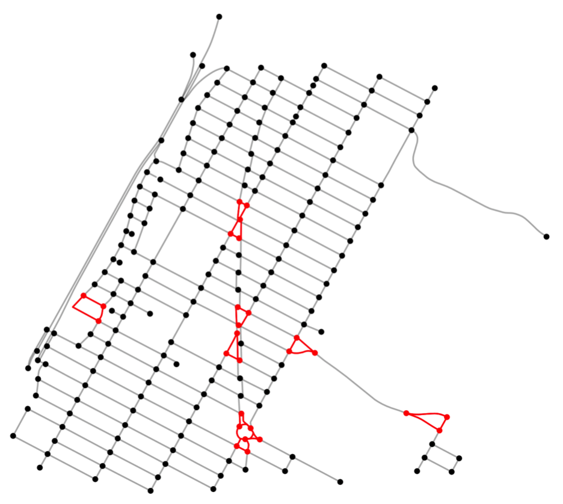
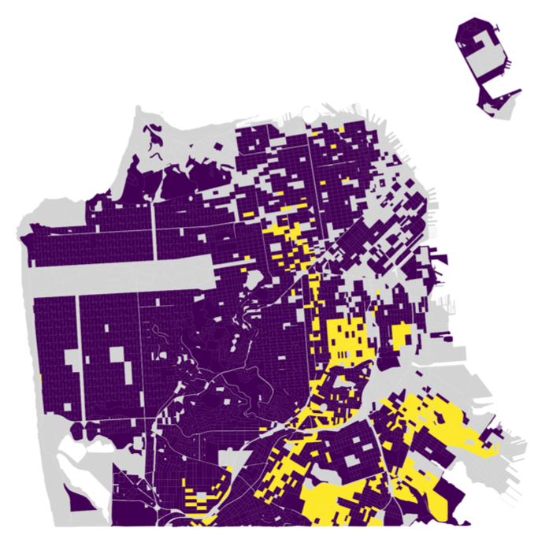
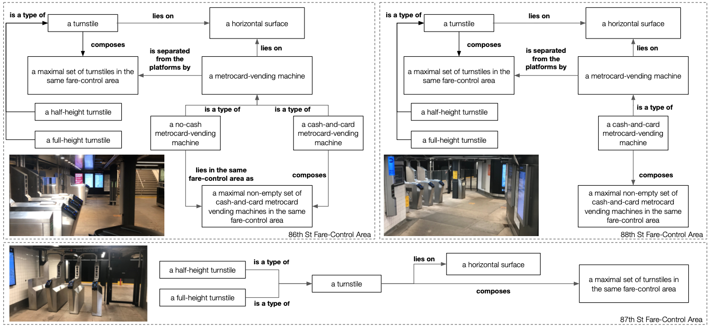
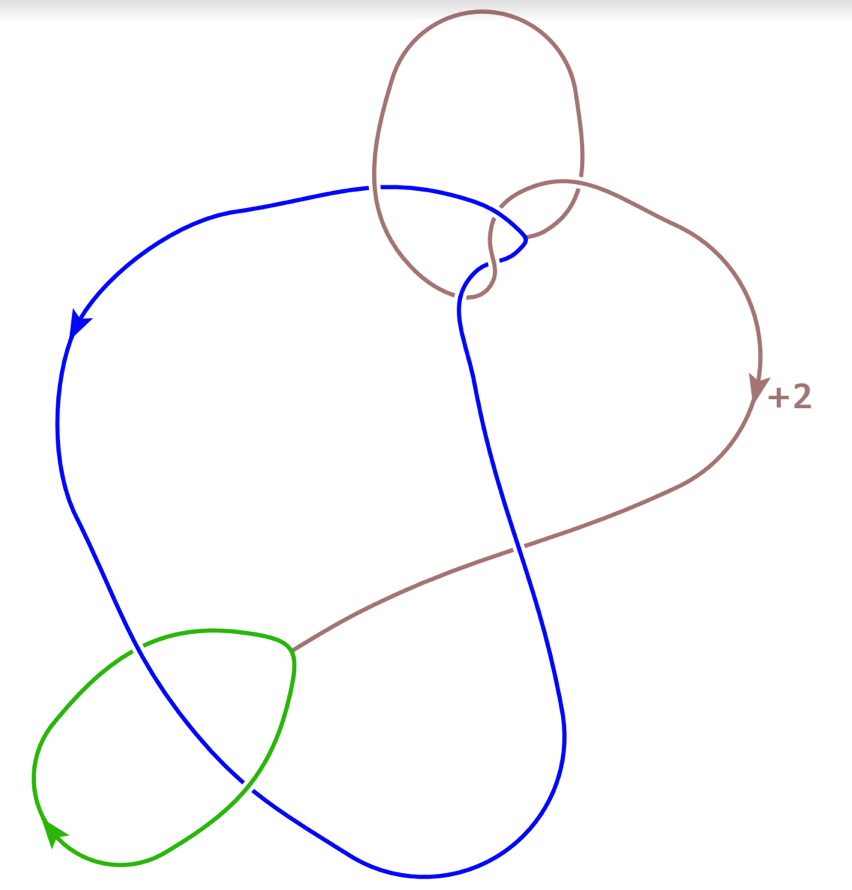

## Graphlets and Urban Morphology

**With whom:** Prof. Trivik Verma and Dr. Juliana Gonçalves

**When:** March 2020 - current

**What:** Street networks encompass much of the visual identity we attribute to cities. The gridded blocks of North-American metropoles, the narrow disorganized streets of Brazilian favelas, and the coencentric circles of European historical districts carry morphological information of those cities that may reveal interesting patterns of accessibility and urban growth. Thinking of street networks as composed of small connected subgraphs---graphlets: a square block, a path of three streets, a triangle---we would like to identify building blocks of cities. This is a common technique in biological and social networks, where the graphlets (or motifs) have been shown to correlate with the function or type of the network. Looking at graphlets of up to 4 nodes in the street networks of New York City, we identify local structures such as gridded patches through spatial auto-correlation statistics. This methodology can be quickly applied to any city in the world, helping researchers classify local street structures and identify common urban development trends across many cities.

**How can I learn more:** We are currently preparing a manuscript of our work for journal publication. Recently, our work got accepted for an oral presentation at the [30th GISRUK](https://gisruk.org) conference, and you can read our [extended abstract](../files/graphlets_abstract.pdf) with preliminary findings.

---
## Equity in the San Francisco Public School Assignment

**With whom:** Prof. Irene Lo, Riya Bery, Juan Langlois, and Qian Zhao

**When:** June 2021 - December 2021

**What:** The San Francisco Unified School District (SFUSD) has partnered with the SDS DSSG team to develop a policy recommendation for how students are assigned to public elementary schools in SFUSD. This zone-based assignment policy incorporates an equity tiebreaker: a priority system to improve access to schools for historically underserved communities. In this project, we identified appropriate geographic proxies for assigning equity tiebreakers and explored the effect of the tiebreaker on improving equity of access. This project helps to inform the implementation of the equity tiebreaker in the assignment policy in the school year 2023-24.

**How can I learn more:** We have presented our work during the final week of the Stanford Data Science for Social Good program, and you can watch the video [in YouTube](https://www.youtube.com/watch?v=48FYug28Bzw&t=3531s)

---
## Ontologies for Underground Mass Transit

**With whom:** Prof. Debra Laefer and Sandy Zhang

**When:** June 2020 - October 2021

**What:** The construction and expansion of subway systems represents an important step towards better livability conditions in a rapidly urbanizing world. However, underground construction has not benefited from well-established ontologies of semantic and geometric representation, such as Building Information Modelling (which is used for standalone structures) and City Geography Markup Language (which is designed for continuous urban elements). To bridge that gap, this paper proposes a novel and highly flexible means to underpin a relevant ontology. The approach uses the ontology log, or olog, a model of knowledge representation based on Category Theory. In an olog, dependencies between objects are restricted to functional relationships (for every object there is a unique correspondence). This robust mathematical formulation allows for a more flexible, yet also informative and user-readable model of the studied entities. In this paper, the olog’s usability is demonstrated through the ontological representation of common items in the fare-control areas of two New York City metro stations. Ologs are shown to capture similar underlying structures both across different stations and within the same station. Importantly, the olog allows for further generalization to incorporate pre-existing data, as well as being a transferable framework for conceptualizations of other metro systems.

**How can I learn more:** We have published our work on the [3D GeoInfo conference](https://3dgeoinfo2021.github.io), held in October 2021. You can [read our paper](https://www.int-arch-photogramm-remote-sens-spatial-inf-sci.net/XLVI-4-W4-2021/125/2021/)

---
## Knot Surgery and Integer Characterizing Slopes

**With whom:** Prof. Kyle Hayden, Prof. Aliakbar Daemi, Sophia Chen, Christian Serio, Cecilia Wang, Anton Wu, and Kexin Wu

**When:** Summer 2019

**What:** Many important questions in low-dimensional topology can be reframed as questions about knots and links, simpler objects that we can easily draw by hand. In fact, any smooth, compact 3- or 4-dimensional manifold can be described and manipulated through surgery on a knot, an operation defined by a rational number known as the slope; and such rational number is characterizing slope for a certain knot if surgery on no other (non-isotopic) knot produces a homeomorphic manifold. This framework was invented in the 1970s but has recently been implemented using computational topology software. Using computational and theoretical approaches, we found that non-twist knots with unknotting number one and less than 11 crossings have at most one integer characterizing slope, positively answering a question posited by Baker and Motegi in 2018 regarding whether small knots had infinitely many non-characterizing slopes. We also proved that our results hold for larger knots, essentially classifying integer surgery on all non-twist unknotting-number-one knots.

**How can I learn more:** We have presented our work during the final week of the Mathematics Department REU program, and you can watch the video [in YouTube](https://youtu.be/0LLg-Lr_me4)
