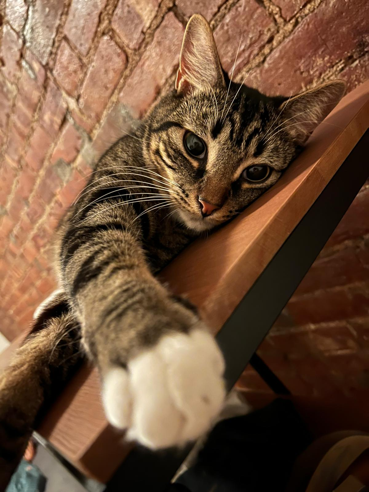
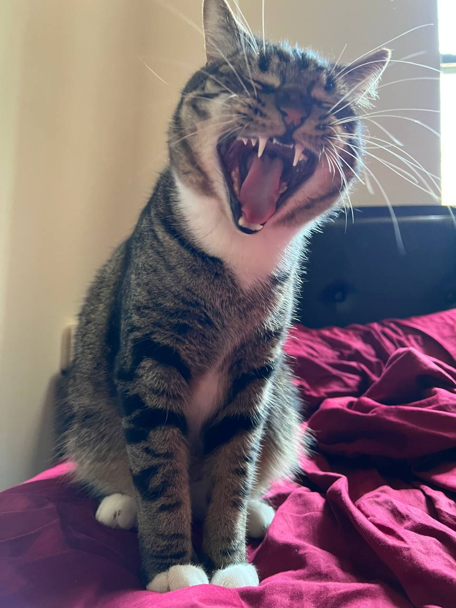
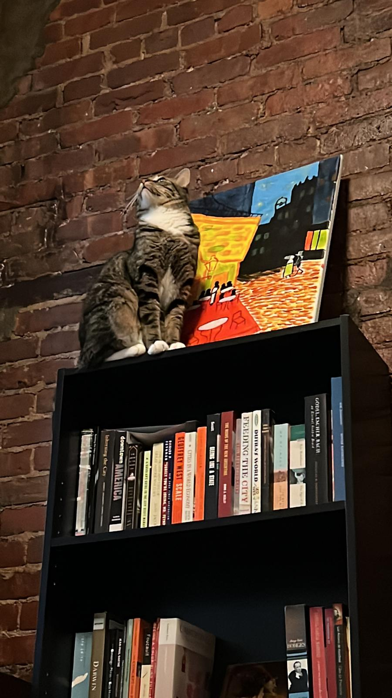
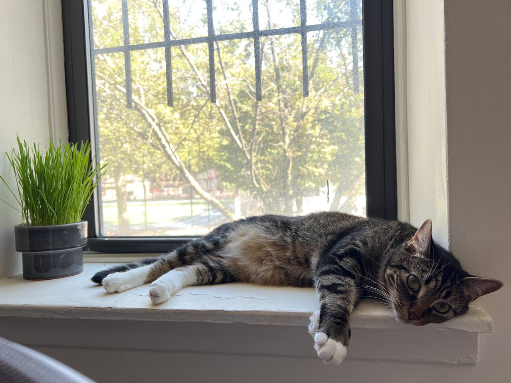

Mezcal (or Mezzi) is a young cat at the peak of his 2 years. A tabby boy with white mittens (and boots!), he loves boxes, string toys, and attention. He hates bacon. Below are some of my favorite pictures of him.

  

  <em> Mr. Mezzi is a gentleman who takes his royal seat on my office chair. Sorry, I can't attend the meeting today. </em>

   

  <em> "Your package cat has been delivered. Order was left in the building mail room." </em>

  

  <em> His mittens are im-paw-ssibly cute! </em>

  

  <em> Sometimes I remember there is a carnivore, a descendant of big hunter felines such as tigers, living in my house. </em>

  

  <em> Sometimes I forget all of the above, especially when we cuddle. </em>

  

  <em> A very erudite cat, Mr. Mezcal also enjoys visiting museums and discussing Art. </em>

  

  <em> Indoor cats when they discover a green plant. </em>

