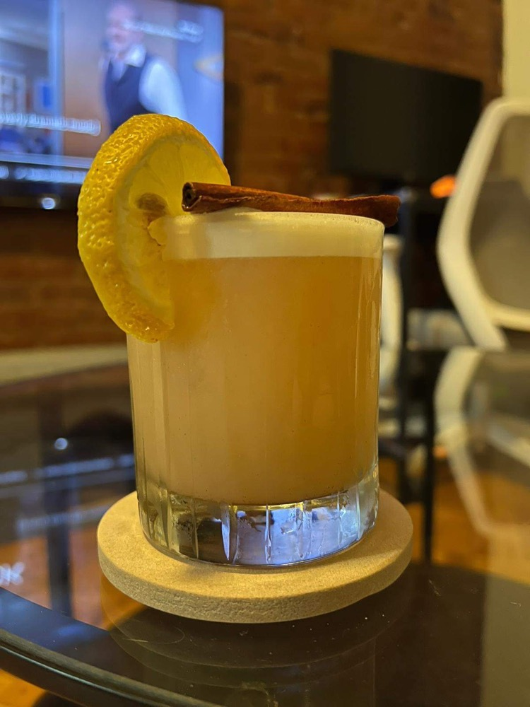
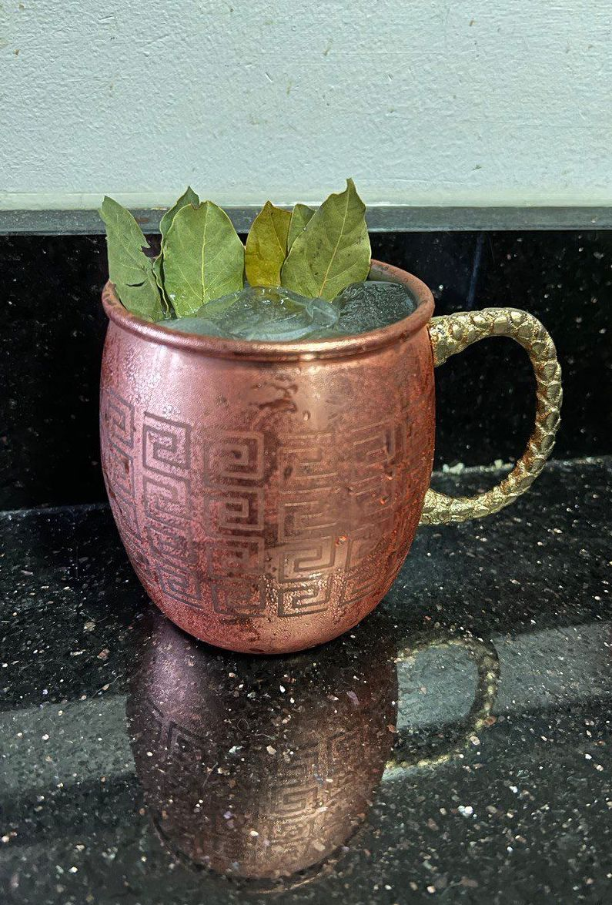
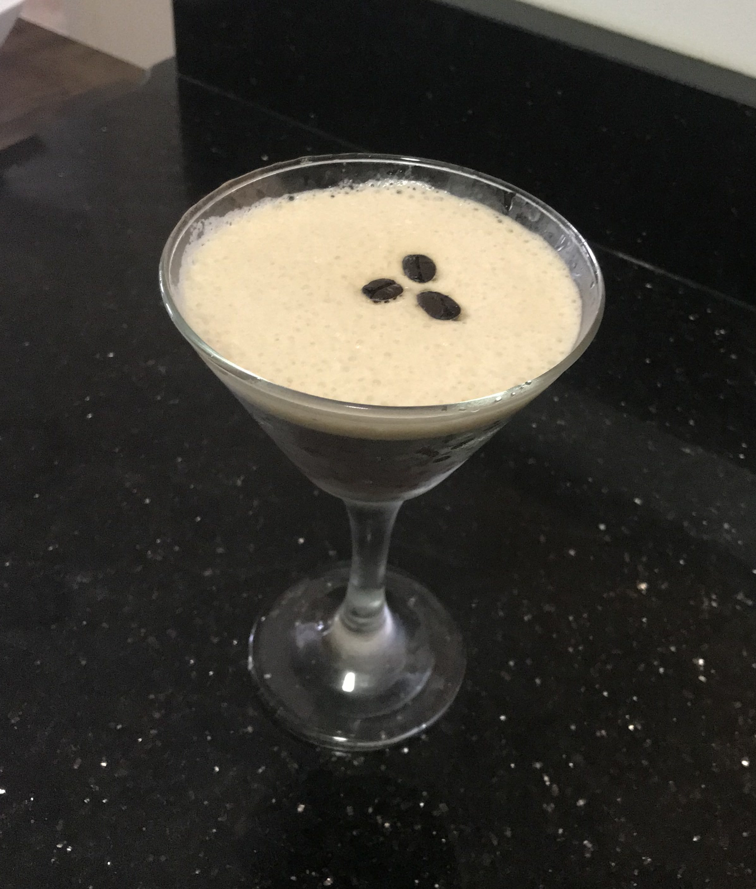
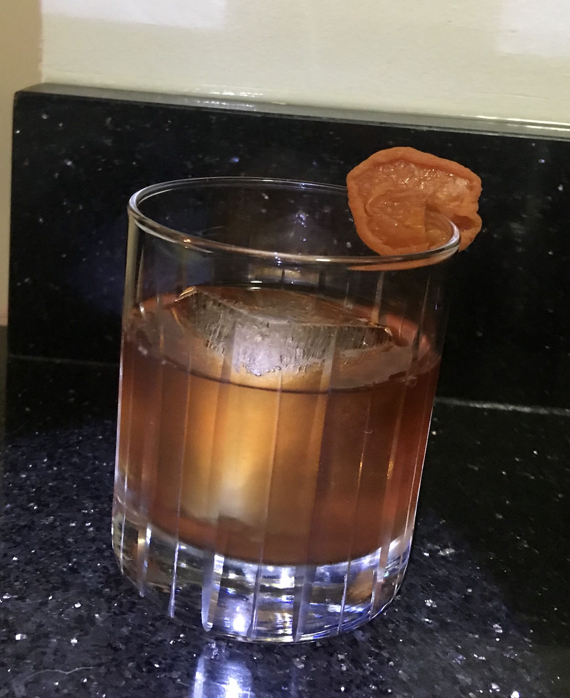
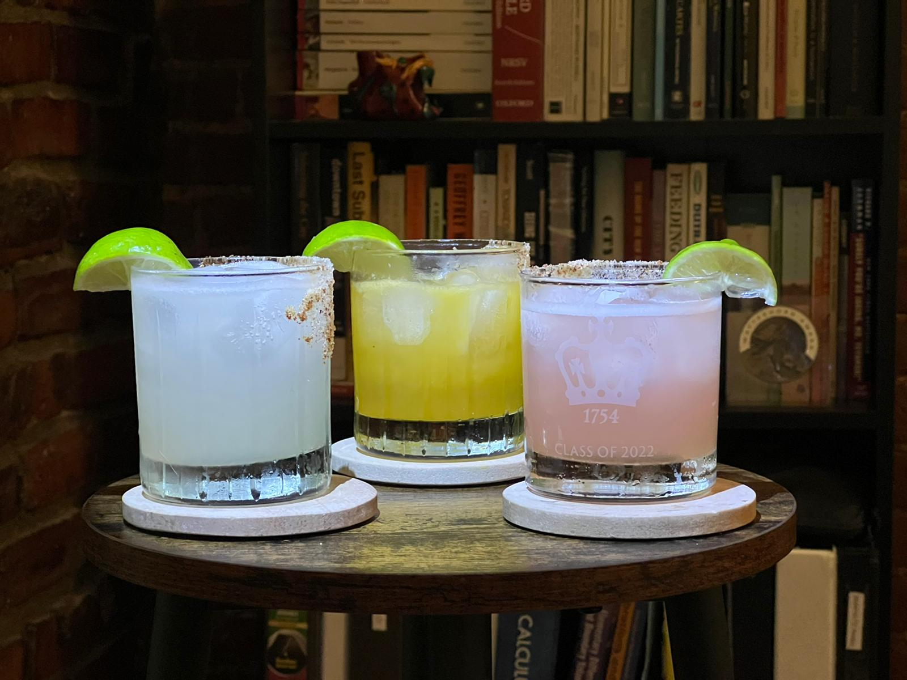

One of my hobbies is to make cocktails. I am a fan of the classics: [negronis](../images/cat/mezcal_and_negroni.jpg) are my all-time favorite drinks. However what I really enjoy is experimenting with new flavors and combinations. I enjoy playing with variations on drinks that add unusual spirits or attempting to create a new cocktail altogether.

Below are a few of my favorite authoral drinks, which I have poorly named. Please let me know if you think of better names for them. A few general remarks:

- As a Mathematician, I am terrible with quantities. Most of the drink recipes below are based on proportions, and you should adjust for the amount you want.
- Egg white creates a foam layer on top of a drink. To do that, add all ingredients (including the egg white) to a shaker without ice and shake like your life depends on it for 30 seconds. Then open the shaker, check that the egg white has foamed, add ice, and shake again. If you are making more than one drink, the foam is usually at the end, so pour half of each glass and only then complete them as opposed to filling one glass and then the other.
- Simple syrup is very simple to make: boil 1 part water, add 1 part sugar, and mix it until it dissolves. Variations on simple syrup require another ingredient (yerba mate, coffee, rosemary leaves) to be added along with the sugar, but remember to strain it well.

### Smoky Fall Punch

- 1 1/2 oz. of Mezcal
- 1 1/2 oz. of Cachaça
- Angostura bitters
- 1/2 lemon juice (squeezed)
- 1/2 egg white
- [Trader Joe's Spiced Cider](https://www.clubtraderjoes.com/2012/11/trader-joes-spiced-apple-cider.html)
- Cinnamon powder

Again, shake the ingredients dry first to foam the egg white. Cachaça and Mezcal are a perfect pairing: smokyness and sweetness counterbalance each ohter in this cocktail. I used a lowball class, but i am imagining this would look very cool in a cooper mug like a Moscow Mule. Garnish with a lemon wheel, some cinnamon powder on top of the foam, a cinnamon stick, or all of those!

 

### Mule Olympus

- 1 1/2 oz. of Tsipouroc
- 1/2 oz. of Ouzo
- 1/2 lime juice (squeezed)
- Ginger Beer

This is a highball, no need to shake. Simply pour everything over ice and garnish with laurel leaves---like your own Olympic crown! M. Olympus is a cocktail to be sipped by the Greek Gods themselves, so make sure your copper mug is divinely appropriate.

 

### Capuccino Martini

- 1 1/2 oz. of Mezcal (e.g. Banhez)
- 1/2 oz. of Bourbon (e.g. Evan Willians BIB)
- 1 oz. of coffee
- 2 dashes of Aztec chocolate bitters (e.g. [Fee Brothers](https://www.feebrothers.com/bitters?lightbox=dataItem-krp81yry1))
- optional: splash of simple syrup

A riff on the espresso martini by someone without an espresso machine. Mezcal adds smokyness to this drink and the Bourbon counterbalances it with caramel-like sweetness, and bitters add a chocolate finish. I added the brands I use in this drink because I think the smoky-to-sweet ratio may be brand specific. Coffee brewed with a pourover worked great for me, but by all means use an espresso shot if you can. Syrup is optional if you prefer sweeter cocktails. Shake it with ice, pour on a chilled martini glass, and garnish with three coffee beans.

 

### Armenian Sidecar

- 2 oz. Armenian ArArAt Cognac
- 0.25 oz. of Pomegranate Liquor
- 2 dashes Black walnut bitters (e.g. [Fee Brothers](https://www.feebrothers.com/bitters?lightbox=dataItem-krp81ys0))
- optional: splash of date syrup (e.g. [Trader Joe's](https://www.traderjoes.com/home/products/pdp/organic-date-syrup-070849))

This is a cocktail I feel bad to make. Armenian cognac is so great that it is almost better to be savoured neat. But adding just a little of other (Armenian-inspired) ingredients elevates it to a riff on the classic Sidecar cocktail. The apricot notes of the cognac are balanced by a splash of pomegranate zestyness, and the walnut bitters give it a nutty finish that you could only find in the Caucasus. Date syrup can be added for a sweeter drink, depending on the sugar content of your pomegranate liquor. Stirr it very gently with ice and pour it over a large ice cube, or neat. Garnish with a dried apricot.

 

<!--### Piña Queimada

- 1 oz. of Malibu Coconut Rum
- 1 oz. of Mezcal
- 1/2 lime juice (squeezed)
- Coconut cream
- Pineapple juice

Mezcal and pineapple are another perfect match. This Piña Colada variation has a smoky kick, and the lime juice adds some citrus freshness. Must be shaken. For a less sweet, more alcoholic version, repalce the Malibu rum with plain white rum. Also works if you replace the coconut cream with half and half (but then keep the malibu).

 -->

### Pomegranate Mezcalita

- 1 1/2 oz. of Mezcal
- 1/2 oz. of Pomegranate Liquor
- 1/2 oz. of simple syrup
- 1/2 lime juice (squeezed)
- Pineapple juice

Mezcal and pineapple again, but now with some pomegrante to sweeten this duo. Look at this color! Garnish with some cayenne pepper and salt on the rim: spicyness goes really well against this sweetness. Picture also shows the more traditional classic and passion fruit mezcalita.

### Ginmarrão

- 1 1/2 oz. of Mezcal
- 1 oz. of Gin
- Orange bitters
- 1 lemon juice (squeezed)
- 1/2 oz. yerba-mate simple syrup (1/2 part yerba mate, 1 part sugar, 1 part water, strain well)
- 1/2 egg white

This is the cocktail I have spent years trying to make: a variation on the typical yerba-mate drink from South Brazil, where I am from, the chimarrão. I don't particularly need the flavor of egg white in this cocktail, but it makes the cool foam on top which anyone from Porto Alegre knows is essential to a trustworhy chimarrão. I also would want to try to pour this on a coupe glass, without ice. Garnish with lemon peel, and maybe some yerba mate on the side of the glass.

 
